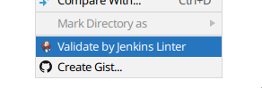

# jenkins-linter-idea-plugin

<!-- Plugin description -->
**jenkins-linter-idea-plugin** is an Intellij Idea plugin to validate Jenkinsfiles by 
the [Pipeline Linter](https://www.jenkins.io/doc/book/pipeline/development/#linter) of a Jenkins server.

## Features

- [x] Supports declarative pipeline only
- [x] HTTP linter integration
- [x] Linting errors highlighting  

## Installation

The plugin can be installed with **Settings | Plugins | Marketplace** and searching for **Jenkins Pipeline Linter**.

## Settings

Settings for the plugin can be found under **Settings | Tools | Jenkins Linter**.

## Usage

- Configure Jenkins server connection via plugin settings.
- Open context menu on file and click **Validate by Jenkins Linter**

<!-- Plugin description end -->

## Contributing

Feel free to contribute.
New feature proposals and bug fixes should be submitted as GitHub pull requests.
Fork the repository on GitHub, prepare your change on your forked copy, and submit a pull request.

**IMPORTANT!**
>Before contributing please read about [Conventional Commits](https://www.conventionalcommits.org/en/v1.0.0-beta.2/) / [Conventional Commits RU](https://www.conventionalcommits.org/ru/v1.0.0-beta.2/)
